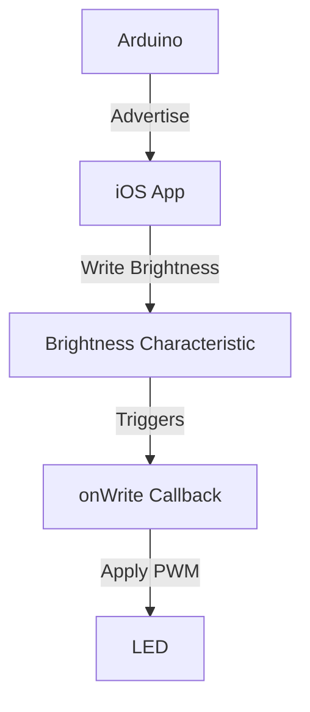
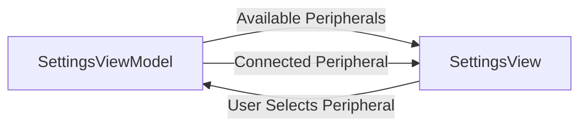
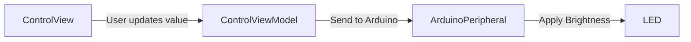

# BluetoothTest
Practice project using CoreBluetooth and ArduinoBLE. The project uses an Arduino UNO WiFi as Peripheral and SwiftUI iOS App as Central.

# Arduino
LedService setups the Arduino as a Peripheral, setting a Led Service and a Led Characteristic that Centrals can connect to. Once a Central is connected and updates the characteristic with a value (from 0 to 255), it is applied to a PWM Pin, applying the received brightnes to the LED.

# iOS
The iOS apps is composed of 2 screens. Control and Settings.

## Settings

In the Settings screen we make use of CentralManager and PeripheralManager. Central Manager is responsible of scanning for available Peripherals and attemp to connect to the peripheral users select. We store the connected Peripheral in the PeripheralManager so we can send messages to it afterwards.

## Control
Control screen has a slider that on change, PeripheralManager sends the new value to our Peripheral. The Peripheral then applies the value to the LED.

# Demo

https://github.com/user-attachments/assets/83cafe48-1466-4cdb-bebf-51d874123924
